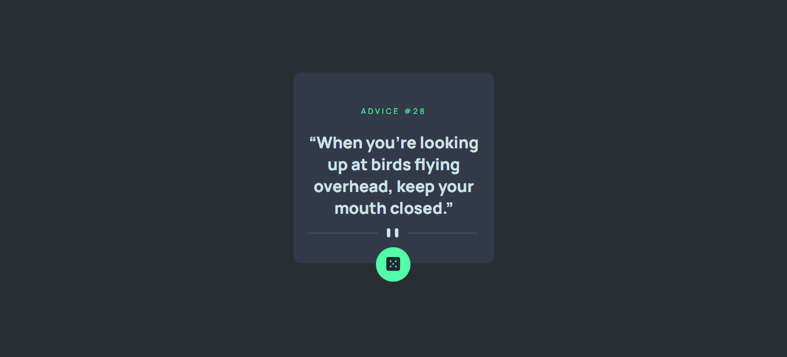

# Frontend Mentor - Advice generator app solution

This is a solution to the [Advice generator app challenge on Frontend Mentor](https://www.frontendmentor.io/challenges/advice-generator-app-QdUG-13db). Frontend Mentor challenges help you improve your coding skills by building realistic projects.

## Table of contents

- [Overview](#overview)
  - [The challenge](#the-challenge)
  - [Screenshot](#screenshot)
  - [Links](#links)
- [My process](#my-process)
  - [Built with](#built-with)
  - [What I learned](#what-i-learned)
  - [Useful resources](#useful-resources)
- [Author](#author)

## Overview

### The challenge

Users should be able to:

-Randomly Generate Advice
-See advice generated in a nice preview card

### Screenshot



### Links

- Solution URL: [GitHub](https://github.com/folorunsho-tech/advice-gen)
- Live Site URL: [Website](https://advice-jen.netlify.app/)

## My process

### Built with

- Flexbox
- Mobile-first workflow
- [Vue Js](https://vuejs.org/) - JS library

### What I learned

-I learned how to build a basic web app using vuejs

- I learned how to fetch data and dispaly data on component mounted

```js
import { onMounted, ref } from "vue";
const advice = ref({});

const fetchAdvices = async () => {
  const data = await (await fetch("	https://api.adviceslip.com/advice")).json();
  advice.value = data.slip;
};
onMounted(async () => {
  await fetchAdvices();
});
```

### Useful resources

- [Vue Js Docs](https://vuejs.org/guide/introduction.html) - This is the official Vue js Documentation, It is well written in aiding beginners with building web apps using vuejs.

- [Vue Js Examples guide](https://vuejs.org/examples/#hello-world) - This contains example in building some common features in web app with Vue js, This resource helped me in understanding how to fetch data using the composition api.

## Author

- Website - [Folorunsho Ibrahim babtunde](https://www.fibr.vercel.com)
- Frontend Mentor - [@folorunsho-tech](https://www.frontendmentor.io/profile/folorunsho-tech)
- Twitter - [@tacheyontechs](https://www.twitter.com/tacheyontechs)

```

```

## Recommended IDE Setup

[VSCode](https://code.visualstudio.com/) + [Volar](https://marketplace.visualstudio.com/items?itemName=johnsoncodehk.volar) (and disable Vetur) + [TypeScript Vue Plugin (Volar)](https://marketplace.visualstudio.com/items?itemName=johnsoncodehk.vscode-typescript-vue-plugin).

## Customize configuration

See [Vite Configuration Reference](https://vitejs.dev/config/).

## Project Setup

```sh
npm install
```

### Compile and Hot-Reload for Development

```sh
npm run dev
```

### Compile and Minify for Production

```sh
npm run build
```
